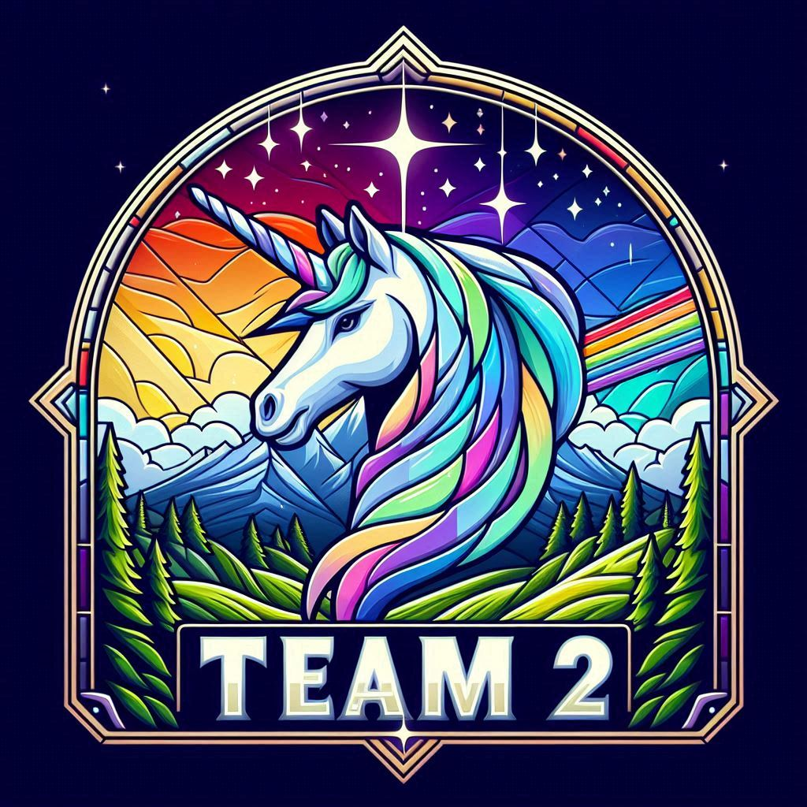

# Images

The following where generated with `DALL-E 3`.

Prompt: `Generate an image in the style of Delft blue tile for AI Powered Finance`

Prompt: `Generate an image of a coding fox with a coffee in the style of stained glass`

Prompt: `Generate an image of a coding fox with a coffee in the style of stained glass`

Prompt: `Generate an image of a coding fox with a coffee in the style of stained glass`

Prompt: `Generate an image of a coding fox with a coffee in the style of stained glass`

Prompt: `Generate unicorn with mountains and unicorn in the background in the style of Morrocan cement tiles`

Prompt: `Generate unicorn with mountains and unicorn in the background in the style of Morrocan cement tiles`

Prompt: `Generate unicorn with mountains and unicorn in the background in the style of Morrocan cement tiles`

Prompt: `Generate unicorn with mountains and unicorn in the background in the style of Morrocan cement tiles`

Prompt: `Generate a picture of the coding ninja cat with flag saying Team 1 in Delft Blue Style`

Prompt: `Generate a picture of the coding ninja cat with flag saying Team 1 in Portuguse pavement Style`

Prompt: `Generate a picture of the coding ninja cat with flag in Delft Blue Style`

Prompt: `Generate a picture of the coding ninja cat with flag saying Team 1 in Delft Blue Style`

Prompt: `Generate a picture of the coding ninja cat with flag saying Team 1 in Delft Blue Style`

Prompt: `Generate a picture of the coding ninja cat with flag in Delft Blue Style`

Prompt: `Generate unicorn in the style of Portuguese Pavement`

Prompt: `Generate unicorn in the style of Portuguese Pavement`

Prompt: `Generate unicorn in the style of Portuguese Pavement`

Prompt: `Generate unicorn in the style of Portuguese Pavements`

Prompt: `Generate unicorn in the style of Portuguese Pavement tiles`

Prompt: `Generate unicorn in the style of Portuguese Pavement tiles`

Prompt: `Generate unicorn in the style of Portuguese Pavement tiles`

Prompt: `Generate unicorn with mountains and unicorn in the background with saying Team 2 in stained glass style`

Prompt: `Generate unicorn with mountains and unicorn in the background with saying Team 2 in stained glass style`